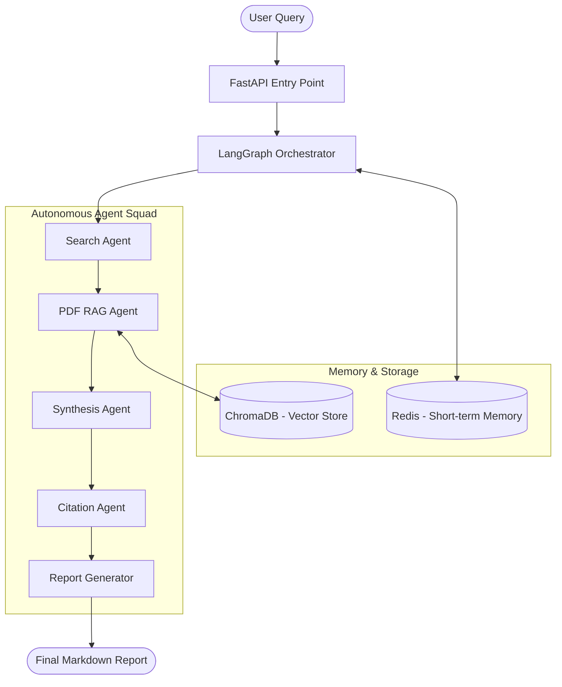

# 🚀 Research.AI: Multi-Agent Autonomous Research Assistant

[](https://fastapi.tiangolo.com/)
[](https://www.langchain.com/)
[](https://langchain-ai.github.io/langgraph/)
[](https://www.docker.com/)

**Research.AI** is a production-grade, autonomous multi-agent platform designed to automate complex research workflows. By leveraging a stateful graph-based orchestration, the system coordinates specialized AI agents to search the web, analyze internal documents, synthesize findings, and generate professional, citation-backed reports.

---

## 📑 Table of Contents
- [🧠 System Architecture](#-system-architecture)
- [🤖 Multi-Agent Ecosystem](#-multi-agent-ecosystem)
- [✨ Key Features](#-key-features)
- [🛠️ Technology Stack](#-technology-stack)
- [🚀 Quick Start](#-quick-start)
- [📂 Project Structure](#-project-structure)
- [🛡️ API Documentation](#-api-documentation)

---

## 🧠 System Architecture

The platform follows a **Directed Acyclic Graph (DAG)** pattern orchestrated by **LangGraph**, ensuring state persistence and structured communication between agents.



---

## 📸 Application Walkthrough

### Step 1: Research Dashboard
Initialize your research tasks through our high-fidelity glassmorphism interface. Define your objective in the spacious research terminal.


### Step 2: Multi-Agent Execution
Monitor real-time "Intelligence Logs" as agents coordinate web searching, PDF indexing, and deep analysis.


### Step 3: Structured Report Generation
Receive professional, markdown-formatted research reports with semantic structuring and source traceability.


---

## 🤖 Multi-Agent Ecosystem

| Agent | Responsibility | Tools |
| :--- | :--- | :--- |
| **Planner** | Orchestrates the graph flow and manages state. | LangGraph |
| **Search Agent** | Conducts deep web searches & extracts real-time data. | Tavily, DuckDuckGo |
| **PDF Agent** | Performs semantic search across uploaded documents. | ChromaDB, PyPDF |
| **Summarizer** | Synthesizes raw data into key insights & trends. | Groq (Llama 3.3) |
| **Citation Agent** | Validates sources and generates research-grade references. | Custom Formatter |
| **Report Agent** | Assembles the final structured Markdown document. | Groq (Llama 3.3) |

---

## ✨ Key Features

- **Autonomous Research**: Parallel execution of web and document search.
- **Enterprise RAG**: Recursive character splitting and semantic indexing for high-accuracy retrieval.
- **Stateful Memory**: Persistent research state across agent nodes.
- **Premium UI**: Dark-themed Glassmorphism dashboard with live "Intelligence Logs".
- **Docker-Ready**: Microservices architecture ready for cloud deployment.

---

## 🛠️ Technology Stack

- **Orchestration**: LangGraph, LangChain
- **LLM Engine**: Groq (Llama-3.3-70b-versatile)
- **Vector Database**: ChromaDB
- **Database/Memory**: Redis
- **Backend Framework**: FastAPI, Pydantic V2
- **Frontend**: Vanilla JS, CSS Glassmorphism, FontAwesome 6
- **Deployment**: Docker, Docker Compose

---

## 🚀 Quick Start

### 1. Environment Setup
Create a `.env` file in the root directory:
```bash
GROQ_API_KEY=your_key
TAVILY_API_KEY=your_key
MODEL_NAME=llama-3.3-70b-versatile
```

### 2. Local Installation
```bash
# Create and activate virtual environment
python -m venv venv
.\venv\Scripts\activate

# Install dependencies
pip install -r requirements.txt
```

### 3. Running the Platform
```bash
# Set PYTHONPATH and run
$env:PYTHONPATH = "."
python -m app.main
```
Access the dashboard at `http://localhost:8000`.

---

## 🚀 Execution Guide

### 💻 Local Development
Run the platform natively for development and testing.
```powershell
# 1. Setup Environment
python -m venv venv
.\venv\Scripts\activate

# 2. Install Core Dependencies
pip install -r requirements.txt

# 3. Launch the Assistant
$env:PYTHONPATH = "."
python -m app.main
```

### 🐳 Docker Containerization
Deploy using isolated, production-grade containers.
```bash
# Build Backend & Frontend
docker build -t research-backend:latest .
docker build -t research-frontend:latest -f Dockerfile.frontend .

# Run with environment variables
docker run -p 8000:8000 --env-file .env research-backend:latest
```

### 🛠️ Docker Compose (Orchestrated)
Launch the entire ecosystem (UI + API + Redis) with a single command.
```bash
# Spin up the cluster
docker-compose up --build -d

# Monitor logs
docker-compose logs -f backend
```

### ☸️ Kubernetes (Cloud Native)
Deploy to professional clusters with auto-scaling and self-healing.
```bash
# 1. Initialize Namespace
kubectl create namespace research-assistant

# 2. Apply Configs & Manifests
kubectl apply -f k8s/

# 3. Verify Deployment
kubectl get pods -n research-assistant
kubectl get hpa -n research-assistant
```

---

## 📂 Project Structure

```text
├── app/
│   ├── agents/      # Specialized agent logic
│   ├── graph/       # LangGraph workflow definitions
│   ├── rag/         # Vector DB & PDF processing
│   ├── api/         # FastAPI endpoints
│   ├── models/      # Pydantic schemas & settings
│   └── main.py      # Entry point
├── static/          # Premium Frontend (HTML/CSS/JS)
├── vector_store/    # Persistent ChromaDB storage
└── docker-compose.yml
```

---

## 🛡️ API Documentation

| Endpoint | Method | Description |
| :--- | :--- | :--- |
| `/research` | POST | Trigger the autonomous research graph. |
| `/upload-pdf` | POST | Upload and index a PDF into the knowledge base. |
| `/health` | GET | Check system and agent status. |

---
*Built with ❤️ by Bittu Sharma*
